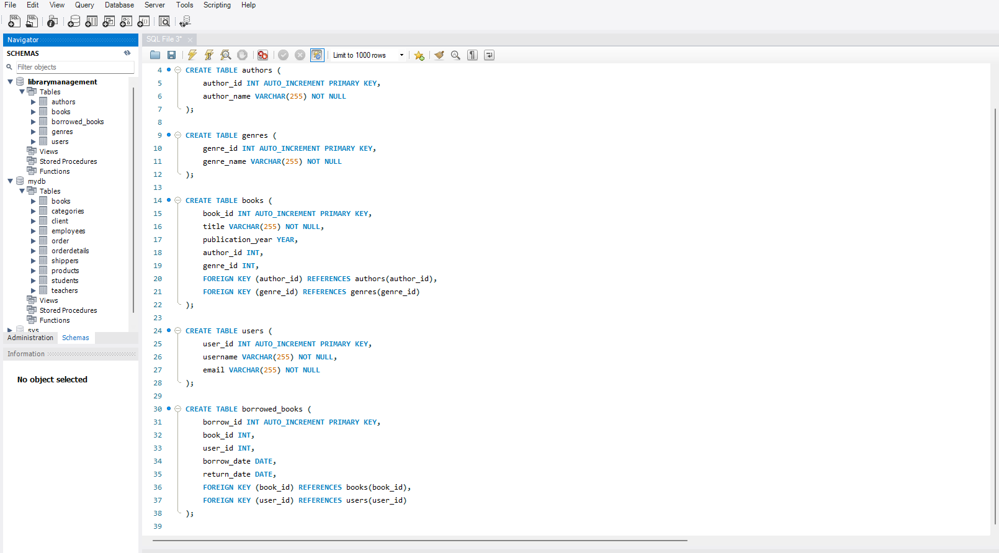
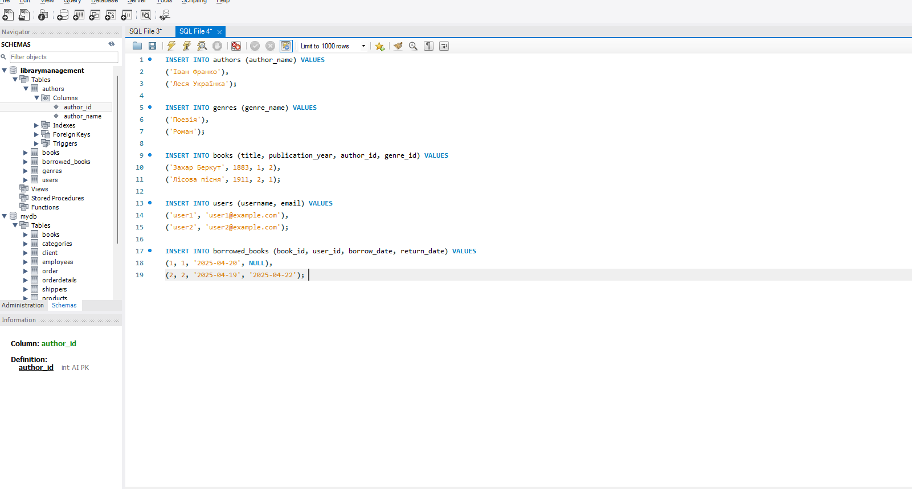
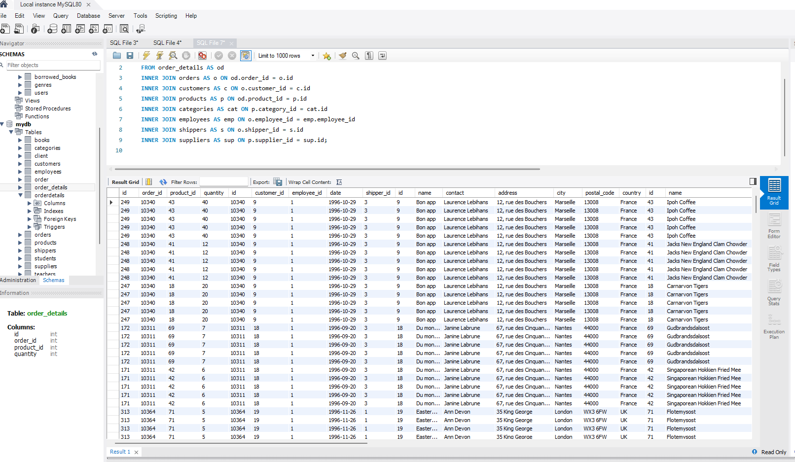

# Домашнє завдання: Керування бібліотекою книг

## 1. Створення бази даних

Створіть базу даних для керування бібліотекою книг згідно зі структурою, наведеною нижче. Використовуйте DDL-команди для створення необхідних таблиць та їх зв'язків.

### Структура БД

- **Схема:** `LibraryManagement`

#### Таблиця `authors`:
- `author_id` (INT, автоінкремент, PRIMARY KEY)
- `author_name` (VARCHAR)

#### Таблиця `genres`:
- `genre_id` (INT, автоінкремент, PRIMARY KEY)
- `genre_name` (VARCHAR)

#### Таблиця `books`:
- `book_id` (INT, автоінкремент, PRIMARY KEY)
- `title` (VARCHAR)
- `publication_year` (YEAR)
- `author_id` (INT, FOREIGN KEY → `authors`)
- `genre_id` (INT, FOREIGN KEY → `genres`)

#### Таблиця `users`:
- `user_id` (INT, автоінкремент, PRIMARY KEY)
- `username` (VARCHAR)
- `email` (VARCHAR)

#### Таблиця `borrowed_books`:
- `borrow_id` (INT, автоінкремент, PRIMARY KEY)
- `book_id` (INT, FOREIGN KEY → `books`)
- `user_id` (INT, FOREIGN KEY → `users`)
- `borrow_date` (DATE)
- `return_date` (DATE)

---

## 2. Заповнення таблиць

Заповніть кожну таблицю простими вигаданими даними (1–2 рядки на таблицю).

---

## 3. Об'єднання таблиць з теми 3

Напишіть SQL-запит з використанням операторів `FROM` та `INNER JOIN`, що об’єднує всі таблиці даних:  
`order_details`, `orders`, `customers`, `products`, `categories`, `employees`, `shippers`, `suppliers`.

🔍 Знайдіть і використайте спільні ключі.

---

## 4. Додаткові запити

- Виконайте запит з пункту 3.
- Визначте кількість рядків за допомогою `COUNT`.
- Змініть декілька операторів `INNER JOIN` на `LEFT JOIN` або `RIGHT JOIN`.  
  📄 Напишіть, що змінилось у кількості рядків та чому (у текстовому файлі).
- Оберіть тільки ті рядки, де `employee_id > 3` та `employee_id <= 10`.
- Згрупуйте за іменем категорії (`category_name`), порахуйте:
  - кількість рядків у групі
  - середню кількість товару (`order_details.quantity`)
- Відфільтруйте групи, де середня кількість товару > 21.
- Відсортуйте результати за спаданням кількості рядків.
- Виведіть на екран 4 рядки, пропустивши перший.

 

.png)
.png)
.png)
.png)
.png)
 
 
